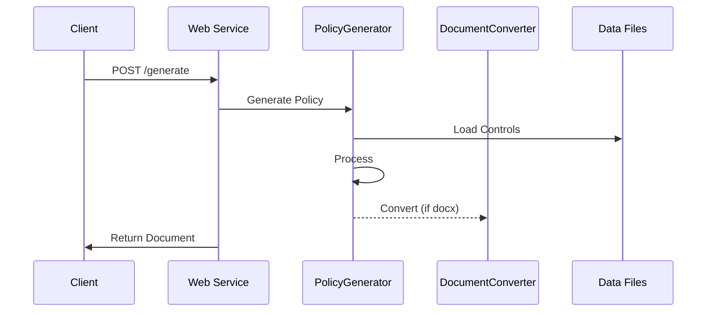

# Adobe CCF Policy Generator

[](https://opensource.org/licenses/MIT)

A powerful web service that automatically generates policy documents based on [Adobe's Common Control Framework (CCF)](https://www.adobe.com/trust/compliance/adobe-ccf.html). This tool helps organizations streamline their compliance documentation process by generating standardized policy documents that align with various security frameworks.

<p align="center">
  
</p>

> Adobe CCF is a security compliance framework that helps organizations meet various compliance requirements through a unified set of controls. It provides a streamlined approach to security compliance by mapping controls across multiple frameworks and standards.

## 🌟 Key Features

- **Framework Alignment**: Built on Adobe CCF Open Source v5
- **Multiple Output Formats**: Generate policies in both Markdown and Word (.docx) formats
- **Flexible Templates**: Customizable policy templates with variable substitution
- **Framework Mapping**: Automatic mapping between different security frameworks
- **REST API**: Simple HTTP endpoint for easy integration
- **Docker Support**: Ready-to-use containerized deployment

## 🚀 Quick Start

### Using Docker (Recommended)

```bash
# Clone the repository
git clone https://github.com/yourusername/adobe-ccf-policy-generator.git
cd adobe-ccf-policy-generator

# Build and run with Docker
docker build -t policy-generator ./backend
docker run -p 5000:5000 policy-generator
```

### Manual Installation

```bash
# Clone and install dependencies
git clone https://github.com/markac007/adobe-ccf-policy-generator.git
cd adobe-ccf-policy-generator/backend
pip install -r requirements.txt

# Run the service
python scripts/generate_policy_from_web.py
```

## 📚 Documentation

### API Usage

```bash
# Generate a policy document in markdown
curl -X POST http://localhost:5000/generate \
     -H "Content-Type: application/json" \
     -d @config.json

# Generate a Word document
curl -X POST "http://localhost:5000/generate?format=docx" \
     -H "Content-Type: application/json" \
     -d @config.json
```

### Example Configuration

```json
{
    "policy_standard": "Access Management",
    "controls": ["AM-01", "AM-02"],
    "frameworks": ["NIST CSF", "PCI DSS v4"],
    "template_path": "custom_template.md"  // Optional
}
```

## 🏗️ Project Structure

```
backend/
├── src/
│   ├── __init__.py
│   └── templates.py          # Template handling logic
├── scripts/
│   ├── generate_policy_from_web.py    # Web service endpoint
│   └── generate_policy_from_input.py  # Core generation logic
├── templates/
│   └── policy_template.md   # Default template
└── data/
    └── processed/           # Processed control data
        ├── control_guidance.json
        ├── controls_v2.json
        └── controls_mapping.json
```

## 🔄 Workflow



## 🛠️ Template Customization

Templates support various variables for customization:

- Basic: `${policy_standard}`, `${current_date}`
- Controls: `${control_id}`, `${control_name}`, `${control_type}`
- Content: `${policy_description}`, `${implementation}`, `${testing_procedures}`

[See Template Documentation](#template-structure) for more details.

## 🤝 Contributing

Contributions are welcome! Please read our [Contributing Guidelines](CONTRIBUTING.md) before submitting PRs.

1. Fork the repository
2. Create a feature branch
3. Commit your changes
4. Push to your branch
5. Open a Pull Request

## 📝 License

This project is licensed under the MIT License - see the [LICENSE](LICENSE) file for details.

## 🙏 Acknowledgments

- Adobe for the Common Control Framework
- Contributors and maintainers
- The security and compliance community

## ⚠️ Security

Found a security issue? Please report it confidentially to [security@yourdomain.com](mailto:security@yourdomain.com).

## 📞 Support

- Create an [Issue](https://github.com/markac007/adobe-ccf-policy-generator/issues)


## 🗺️ Roadmap

- [ ] Update code for next CCF relase
- [ ] Enhanced template customization
- [ ] Enhanced UI for policy generation
- [ ] Batch processing capabilities
- [ ] PDF output format
