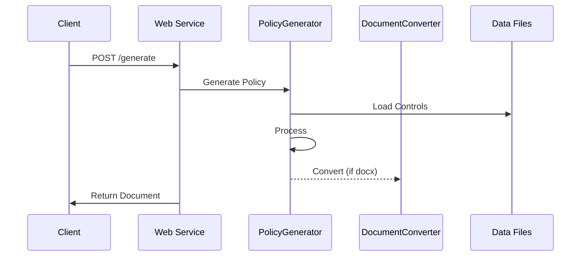

# Adobe CCF Policy Generator

<!-- Build & Deploy -->
[](https://github.com/MarkAC007/adobe-ccf-document-generator/actions/workflows/ci.yml)
[](https://github.com/MarkAC007/adobe-ccf-document-generator/actions/workflows/docker-publish.yml)

<!-- Security -->
[](https://github.com/MarkAC007/adobe-ccf-document-generator/actions/workflows/codeql.yml)
[](https://github.com/MarkAC007/adobe-ccf-document-generator/actions/workflows/semgrep.yml)
[](https://github.com/MarkAC007/adobe-ccf-document-generator/actions/workflows/gitleaks.yml)
[](https://socket.dev)

<!-- Tech Stack -->
[](https://www.python.org/)
[](https://hub.docker.com/r/markac007/adobe-ccf-policy-generator)
[](https://hub.docker.com/r/markac007/adobe-ccf-policy-generator)

<!-- Project Info -->
[](https://github.com/MarkAC007/adobe-ccf-document-generator/releases/latest)
[](https://opensource.org/licenses/MIT)
[](https://github.com/MarkAC007/adobe-ccf-document-generator/commits/main)
[](https://github.com/MarkAC007/adobe-ccf-document-generator/issues)
[](https://github.com/MarkAC007/adobe-ccf-document-generator/pulls)

🚀 **Try it out:** [Live Demo](https://adobe-ccf-demo.compliancegenie.io/)

A powerful web service that automatically generates policy documents based on [Adobe's Common Control Framework (CCF)](https://www.adobe.com/trust/compliance/adobe-ccf.html). This tool helps organizations streamline their compliance documentation process by generating standardized policy documents that align with various security frameworks.

<p align="center">
  
</p>

> Adobe CCF is a security compliance framework that helps organizations meet various compliance requirements through a unified set of controls. It provides a streamlined approach to security compliance by mapping controls across multiple frameworks and standards.

## 🌟 Key Features

- **Framework Alignment**: Built on Adobe CCF Open Source v5
- **Multiple Output Formats**: Generate policies in both Markdown and Word (.docx) formats
- **Flexible Templates**: Customizable policy templates with variable substitution
- **Framework Mapping**: Automatic mapping between different security frameworks
- **REST API**: Simple HTTP endpoint for easy integration
- **Docker Support**: Ready-to-use containerized deployment
- **Visual Template Editor**: Drag-and-drop interface for creating custom templates
- **Modern UI**: Clean, responsive interface with Adobe design elements

## 🚀 Quick Start

### Try the Demo

Visit our [live demo](https://adobe-ccf-demo.compliancegenie.io/) to try the policy generator without installation.

### Using Pre-built Docker Image

```bash
# Pull and run the latest stable image (uses default localhost:5000)
docker pull markac007/adobe-ccf-policy-generator:latest
docker run -p 5000:5000 markac007/adobe-ccf-policy-generator:latest

# Production deployment with custom domain
docker run -p 5000:5000 -e BASE_URL=https://your-domain.com markac007/adobe-ccf-policy-generator
```

### Environment Variables

| Variable | Description | Default |
|----------|-------------|---------|
| BASE_URL | Base URL for API endpoints | http://localhost:5000 |

### Building Locally with Docker

```bash
# Clone the repository
git clone https://github.com/markac007/adobe-ccf-policy-generator.git
cd adobe-ccf-policy-generator

# Build and run with Docker
docker build -t policy-generator ./backend
docker run -p 5000:5000 policy-generator
```

### Manual Installation

```bash
# Clone and install dependencies
git clone https://github.com/markac007/adobe-ccf-policy-generator.git
cd adobe-ccf-policy-generator/backend
pip install -r requirements.txt

# Run the service
python scripts/generate_policy_from_web.py
```

## 📚 Documentation

### API Usage

```bash
# Generate a policy document in markdown
curl -X POST http://localhost:5000/generate \
     -H "Content-Type: application/json" \
     -d @config.json

# Generate a Word document
curl -X POST "http://localhost:5000/generate?format=docx" \
     -H "Content-Type: application/json" \
     -d @config.json
```

### Example Configuration

```json
{
    "policy_standard": "Access Management",
    "controls": ["AM-01", "AM-02"],
    "frameworks": ["NIST CSF", "PCI DSS v4"],
    "template_path": "custom_template.md"  // Optional
}
```

## 🏗️ Project Structure

```
backend/
├── src/
│   ├── __init__.py
│   └── templates.py          # Template handling logic
├── scripts/
│   ├── generate_policy_from_web.py    # Web service endpoint
│   └── generate_policy_from_input.py  # Core generation logic
├── templates/
│   └── policy_template.md   # Default template
├── static/
│   ├── css/                 # Styling files
│   └── js/                  # JavaScript files
└── data/
    └── processed/           # Processed control data
        ├── control_guidance.json
        ├── controls_v2.json
        └── controls_mapping.json
```

## 🔄 Workflow



## 📊 Framework References Structure

The Framework References section maps CCF controls to various security frameworks. The data flow works as follows:

1. **Data Sources**
   - `controls_mapping.json`: Contains mappings between CCF controls and framework references
   - `control_guidance.json`: Contains control details and metadata

2. **Processing Flow**
   ```mermaid
   graph TD
       A[Select Controls] --> B[Load Framework Mappings]
       B --> C[Process Each Control]
       C --> D[Extract Framework References]
       D --> E[Format Table]
       
       subgraph "Framework Mapping Process"
           F[Control ID] --> G[Framework References]
           G --> H[Reference Numbers]
       end
   ```

3. **Table Structure**
   Current:
   ```
   | Control ID | Framework | Reference |
   |------------|-----------|-----------|
   | AM-01     | FedRAMP   | CM-08     |
   | AM-01     | HIPAA     | 164.310   |
   ```

   Desired:
   ```
   | Control ID | FedRAMP | HIPAA    | ISO 27002 |
   |------------|---------|----------|-----------|
   | AM-01     | CM-08   | 164.310  | -         |
   | AM-02     | CM-09   | -        | 5.13      |
   ```

4. **Data Transformation**
   ```python
   # Conceptual flow
   {
     "AM-01": {
       "fedramp_moderate_ref": ["CM-08"],
       "hipaa_security_ref": ["164.310"]
     }
   }
   ↓
   {
     "AM-01": {
       "FedRAMP": "CM-08",
       "HIPAA": "164.310",
       "ISO 27002": "-"
     }
   }
   ```

This transformation requires:
1. Collecting all unique frameworks
2. Creating a matrix of Control IDs × Frameworks
3. Populating references or "-" for each cell
4. Generating a properly formatted markdown table

## 🛠️ Template Customization

The project includes a visual template editor that allows you to:
- Create and modify policy templates
- Drag-and-drop section management
- Configure section properties
- Preview template structure

Access the template editor at `http://localhost:5000/template-editor` after starting the service.

Templates support various variables for customization:

- Basic: `${policy_standard}`, `${current_date}`
- Controls: `${control_id}`, `${control_name}`, `${control_type}`
- Content: `${policy_description}`, `${implementation}`, `${testing_procedures}`

[See Template Documentation](#template-structure) for more details.

## 🤝 Contributing

Contributions are welcome! Please read our [Contributing Guidelines](CONTRIBUTING.md) before submitting PRs.

1. Fork the repository
2. Create a feature branch
3. Commit your changes
4. Push to your branch
5. Open a Pull Request

## 📝 License

This project is licensed under the MIT License - see the [LICENSE](LICENSE) file for details.

## 🙏 Acknowledgments

- Adobe for the Common Control Framework
- Contributors and maintainers
- The security and compliance community

## ⚠️ Security

Found a security issue? Please report it by creating an [Issue](https://github.com/markac007/adobe-ccf-policy-generator/issues)

## 📞 Support

- Create an [Issue](https://github.com/markac007/adobe-ccf-policy-generator/issues)


## 🗺️ Roadmap

- [ ] Update code for next CCF relase
- [X] Enhanced template customization
- [X] Enhanced UI for policy generation
- [ ] Batch processing capabilities
- [ ] PDF output format
- [ ] Add support for indented bullets

.
