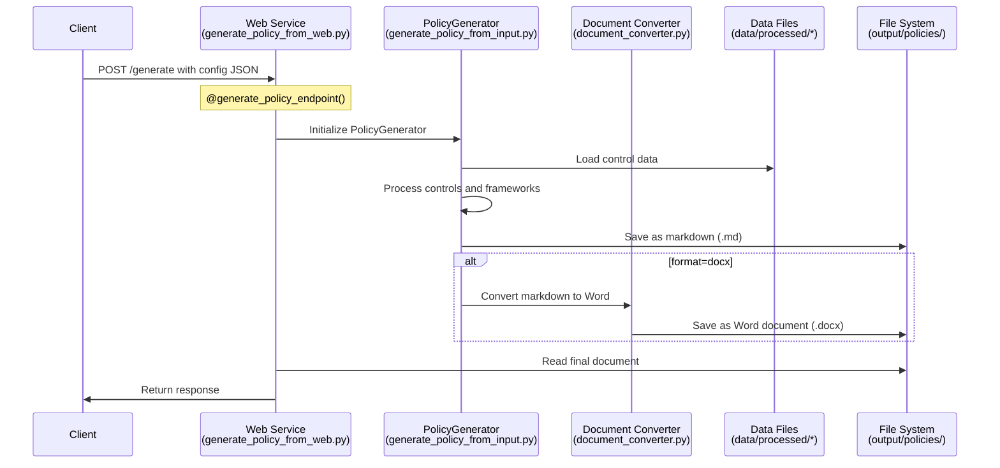

# Adobe CCF Policy Generation Web Service

This service provides a web API endpoint for generating policy documents based on Adobe's CCF.

## Overview

The service is built using Flask and provides a REST API endpoint that accepts policy configuration data and returns generated policy documents in markdown format with the additional option to convert the markdown content to Word (.docx)

## Project Structure
```
backend/
├── src/
│   ├── __init__.py
│   └── templates.py      # Template handling logic
├── scripts/
│   ├── generate_policy_from_web.py    # Web service entry point
│   └── generate_policy_from_input.py  # Core policy generation
├── templates/
│   └── policy_template.md  # Default policy template
└── data/
    └── processed/
        ├── control_guidance.json
        ├── controls_v2.json
        └── controls_mapping.json
```

## Architecture

### Main Components

1. `generate_policy_from_web.py` - Web service entry point
2. `generate_policy_from_input.py` - Core policy generation logic
3. `templates.py` - Template rendering engine
4. `policy_template.md` - Default policy document template
5. Flask web server - Handles HTTP requests

## Workflow

1. **Request Handling**
   - The service listens on port 5000
   - Accepts POST requests at `/generate` endpoint
   - Expects JSON configuration data in the request body
   - Supports both markdown and Word document output formats

2. **Policy Generation Process**   


3. **Document Processing**
   - Markdown content is always generated first
   - Word documents are created by converting the markdown
   - Preserves formatting:
     - Heading levels (H1-H4)
     - Bold text (**text**)
     - Tables
     - Numbered lists
   - Maintains consistent file naming:
     ```
     {policy_name}_policy_{YYYYMMDD}.md
     {policy_name}_policy_{YYYYMMDD}.docx
     ```

4. **Template Processing**
   - Templates use Python's string.Template for variable substitution
   - Supports custom templates via template_path parameter
   - Variables available in templates:
     
     **Basic Variables:**
     - ${policy_standard}
     - ${policy_standard_lower}
     - ${current_date}

     **Control Section Variables:**
     - ${control_sections} - Full formatted control sections
     - ${framework_references} - Framework mapping table

     **Per Control Variables:**
     Each control in the control_sections can access:
     ```
     ${control_id}          - Control identifier
     ${control_name}        - Name of the control
     ${control_theme}       - Theme/category of the control
     ${control_type}        - Type of control (Technical, Administrative, etc.)
     ${policy_description}  - Control policy description
     ${implementation}      - Implementation guidance
     ${testing_procedures}  - Testing procedures for the control
     
     # Arrays (joined with commas by default)
     ${audit_artifacts}     - Required audit evidence

     ```

5. **Example Custom Template Usage**
```markdown
### ${control_id} - ${control_name}
**Type:** ${control_type}
**Theme:** ${control_theme}

#### Policy Description
${policy_description}

#### Implementation Requirements
${implementation}

#### Audit Requirements
**Evidence Required:**
${audit_artifacts}

**Testing Procedures:**
${testing_procedures}
```

6. **Response Format**   
```json
   {
       "success": true,
       "content": "Document content (markdown) or base64 (docx)",
       "format": "md or docx",
       "message": "Successfully generated policy for [standard]"
   }   
```

## Error Handling

The service includes comprehensive error handling:
- Invalid JSON data
- Policy generation failures
- File system errors
- Template rendering errors

All errors are returned in a consistent format: 
```json
{
    "error": "Error message description"
}
```

## Setup and Usage

1. **Installation**
   ```bash
   pip install -r requirements.txt
   ```

2. **Running the Service**
   ```bash
   cd backend
   python scripts/generate_policy_from_web.py
   ```

### Option 2: Docker Installation
1. **Build the Docker Image**
   ```bash
   # From the backend directory
   docker build -t policy-generator .
   ```

2. **Run the Container**
   ```bash
   docker run -p 5000:5000 policy-generator
   ```

3. **Access the Application**
   - Web Interface: http://localhost:5000
   - API Endpoint: http://localhost:5000/generate

### Making API Requests

1. **Making Requests**
   ```bash
   # For markdown output (default)
   curl -X POST http://localhost:5000/generate \
        -H "Content-Type: application/json" \
        -d @config.json

   # For Word document output
   curl -X POST "http://localhost:5000/generate?format=docx" \
        -H "Content-Type: application/json" \
        -d @config.json
   ```

## Dependencies

- Flask
- Flask-CORS
- python-docx (for Word document generation)
- pandoc (for markdown to Word conversion)
- PolicyGenerator (internal module)
- DocumentConverter (internal module)

## Configuration

The service requires:
- Valid JSON configuration data
- Proper file system permissions for temporary file creation
- Network access for web server functionality
- Access to data files in data/processed/
- Pandoc installation (included in Docker image)

## Security Considerations

- CORS is enabled for cross-origin requests
- Input validation is performed on received JSON data
- Template injection protection via string.Template
- File paths are properly sanitized

## Template Structure

The generated policy document follows this structure:

1. **Document Control**
   - Version
   - Last Updated Date
   - Classification

2. **Policy Sections**
   - Purpose
   - Scope
   - Policy Requirements

3. **Control Sections**
   Each control includes:
   ```
   ### [Control ID] - [Control Name]
   
   #### Control Information
   | Type | Theme |
   |:-----|:------|
   
   #### Policy Description
   
   #### Implementation Requirements
   (Numbered list)
   
   #### Testing Procedures
   (Numbered list)
   
   #### Audit Requirements
   | ID | Domain | Title |
   |:---|:-------|:------|
   ```

4. **Framework Mappings**
   Two reference tables are provided:
   
   a. **Control to Framework Mapping**
   ```
   | Control ID | Framework | Reference |
   |:-----------|:----------|:-----------|
   | AM-01 | NIST CSF | ID.AM-1, ID.AM-2 |
   | AM-01 | PCI DSS v4 | 12.5.1, 12.5.2 |
   ```
   
   b. **Framework to Control Mapping**
   ```
   | Framework | Reference | Controls |
   |:----------|:----------|:---------|
   | NIST CSF | ID.AM-1 | AM-01, AM-02 |
   | PCI DSS v4 | 12.5.1 | AM-01, AM-04 |
   ```

## Template Variables

1. **Basic Variables:**
   - ${policy_standard}
   - ${policy_standard_lower}
   - ${current_date}

2. **Control Section Variables:**
   - ${control_sections}
   - ${framework_references}
   - ${reverse_framework_references}

3. **Per Control Variables:**
   - ${control_id}
   - ${control_name}
   - ${control_theme}
   - ${control_type}
   - ${policy_description}
   - ${formatted_implementation}
   - ${formatted_testing}
   - ${evidence_table}

## Data Sources

The service integrates multiple data sources:
- Control guidance (control_guidance.json)
- Control mappings (controls_mapping.json)
- Evidence requirements (erl.json)
- Control data (controls_v2.json)
