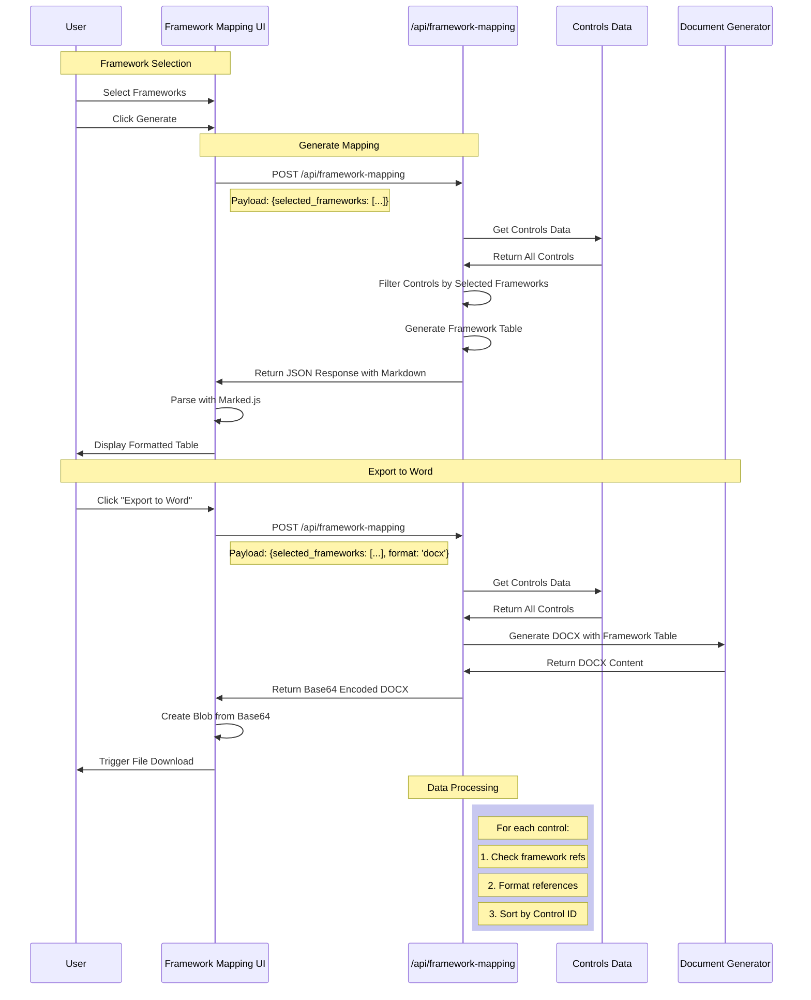

# Product Requirements Document
## Adobe CCF Policy Generator - Framework Control Mapping Viewer

### Overview
**Date:** 2024-03-20
**Author:** Mark Almeida-Cardy
**Status:** Draft

### Problem Statement
Users need a way to quickly view and analyze control mappings across different frameworks without generating a full policy document. Currently, the framework mapping functionality is only available as part of the policy generation process, making it difficult to perform quick framework comparisons and control mapping analysis.

### Goals and Objectives
- Primary Goal: Create a dedicated interface for viewing control mappings across selected frameworks
- Secondary Goals:
  - Simplify the process of framework comparison
  - Reuse existing mapping logic to maintain consistency
  - Provide a clear tabular view of control relationships

### Success Metrics
- Reduced time to analyze framework mappings
- Increased usage of framework comparison functionality
- Positive user feedback on mapping visibility

### Requirements

#### Functional Requirements
1. Framework Selection
   - Multiple framework selection capability using existing multiselect component
   - Support for all frameworks in controls_v2.json
   - Clear visual feedback on selection

2. Control Mapping Display
   - Display ALL controls that map to selected frameworks
   - Show control IDs and descriptions
   - Present framework references in table format
   - Support markdown and DOCX export formats

3. Data Processing
   - Filter controls based only on framework selection
   - Generate consistent table format for both display and export
   - Maintain mapping relationships between controls

#### Technical Requirements
1. Backend Integration
   - Use existing /generate endpoint
   - Support format parameter for DOCX export
   - Optimize control filtering for selected frameworks only

2. Frontend Implementation
   - Reuse existing framework multiselect
   - Add export functionality
   - Implement markdown rendering
   - Handle base64 DOCX conversion

3. Performance Requirements
   - Fast filtering of controls data
   - Efficient markdown generation
   - Quick DOCX conversion

#### User Interface Requirements
1. Page Layout
   - Framework multiselect at top
   - Generate and Export buttons
   - Clear table display of results
   - Loading states for operations

2. Table Display
   - Control ID column
   - Description column
   - Framework reference columns
   - Clear formatting for readability

3. User Experience
   - Loading indicators during generation
   - Error handling messages
   - Download progress for DOCX
   - Clear selection interface

### User Stories
1. As a compliance analyst, I want to select multiple frameworks and see ALL controls that map to them.

2. As a security architect, I want to export the mapping table in both markdown and DOCX formats.

3. As an auditor, I want to see complete framework coverage across all controls.

### Out of Scope
- Policy-specific filtering
- Template customization
- Custom control creation
- Framework editing

### Dependencies
- Existing framework selection component
- Current mapping data structure
- _generate_framework_references_table function
- Framework data in controls_v2.json

### Timeline
- Phase 1: Backend API and data processing (1 week)
- Phase 2: Frontend UI implementation (1 week)
- Phase 3: Testing and optimization (1 week)

### Risks and Mitigation
| Risk | Impact | Likelihood | Mitigation |
|------|---------|------------|------------|
| Performance issues with large datasets | High | Medium | Implement pagination and lazy loading |
| UI complexity with many frameworks | Medium | High | Implement clear visual hierarchy and filtering |
| Data inconsistency with main app | High | Low | Reuse existing data processing functions |


### Data Flow Details

1. **Initial Load**
   - Page loads with framework selection options
   - Loads configuration via /config endpoint to set baseUrl
   - Initializes marked.js parser for markdown rendering

2. **Framework Selection**
   - User selects multiple frameworks using multiselect
   - Client validates required selections (policy and at least one framework)

3. **Generate Mapping Flow**
   - Client constructs request payload with only selected frameworks:
     ```json
     {
       "selected_frameworks": ["framework1", "framework2"]
     }
     ```
   - Client sends POST to /generate endpoint
   - API processes controls data:
     - Gets ALL controls that have mappings to selected frameworks
     - Does not filter by policy (shows complete framework coverage)
     - Formats control data into table structure
   - Returns JSON response with markdown content
   - UI renders using marked.js parser

4. **Word Document Generation**
   - Uses same endpoint with format=docx query parameter
   - Uses identical request payload as markdown generation
   - Server generates DOCX with same content structure
   - Returns JSON response with:
     - base64 encoded file content
     - suggested filename
   - Client creates Blob from base64 content
   - Client triggers file download

### Key Components

1. **Frontend Components**
   - Framework multiselect component
   - Generate button
   - Export to Word button (conditionally displayed)
   - Markdown rendering area with table display
   - Error message display
   - Loading indicators

2. **Backend Services**
   - Configuration endpoint (/config)
   - Framework mapping endpoint (/generate)
   - Document generation service
   - Controls data service

3. **Data Processing**
   - Control filtering by framework
   - Framework reference mapping
   - Table generation logic
   - Format conversion (markdown/docx)

4. **Data Structure**
   ```json
   // Example Control Data Structure
   {
     "control_id": "CCF-1",
     "description": "Control description text",
     "framework_refs": {
       "nist_csf": ["ID.AM-1", "ID.AM-2"],
       "iso_27001": ["A.8.1.1", "A.8.1.2"]
     }
   }

   // Example API Response Structure
   {
     "content": "| Control ID | Description | NIST CSF | ISO 27001 |\n|...|",
     "format": "markdown",
     "status": "success"
   }
   ```

### Technical Flow Diagram

