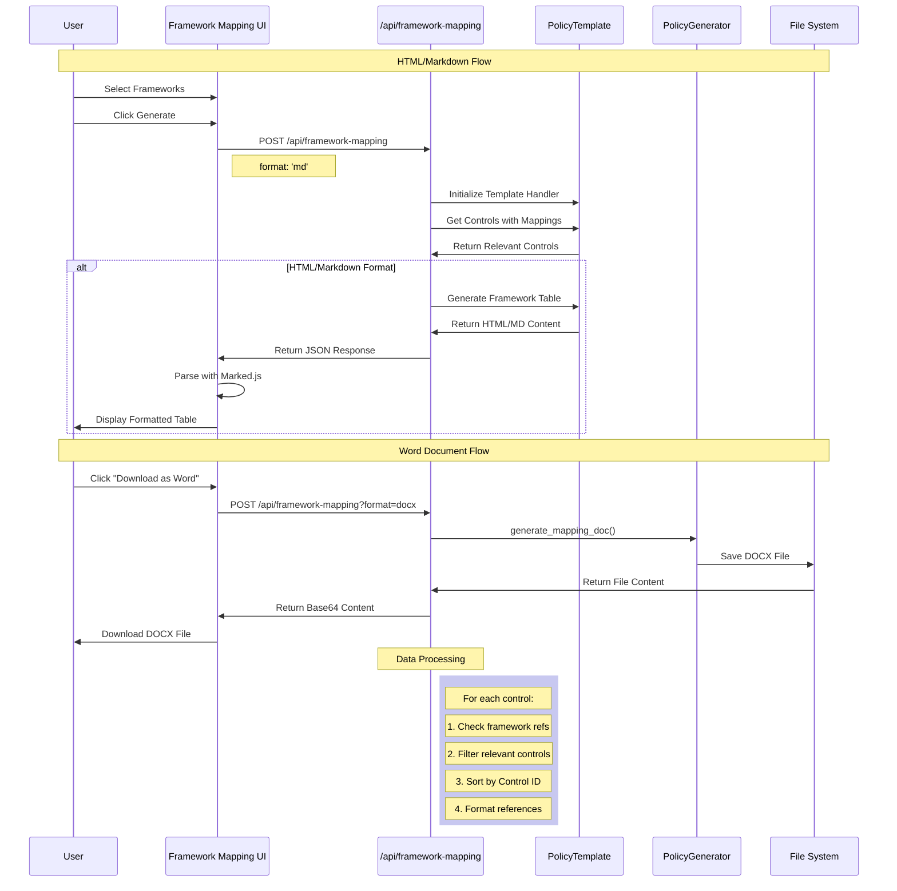

# Product Requirements Document
## Adobe CCF Policy Generator - Framework Control Mapping Viewer

### Overview
**Date:** 2024-03-20
**Author:** Mark Almeida-Cardy
**Status:** Draft

### Problem Statement
Users need a way to quickly view and analyze control mappings across different frameworks without generating a full policy document. Currently, the framework mapping functionality is only available as part of the policy generation process, making it difficult to perform quick framework comparisons and control mapping analysis.

### Goals and Objectives
- Primary Goal: Create a dedicated interface for viewing control mappings across selected frameworks
- Secondary Goals:
  - Simplify the process of framework comparison
  - Reuse existing mapping logic to maintain consistency
  - Provide a clear tabular view of control relationships

### Success Metrics
- Reduced time to analyze framework mappings
- Increased usage of framework comparison functionality
- Positive user feedback on mapping visibility

### Requirements

#### Functional Requirements
1. Framework Selection
   - Multiple framework selection capability
   - Reuse existing framework selection component
   - Display only frameworks that have mapping data

2. Control Mapping Display
   - Show all controls that have mappings for selected frameworks
   - Display mapping references (e.g., control IDs)
   - Include control descriptions
   - Sort and filter capabilities

3. Data Processing
   - Reuse existing _generate_framework_references_table function
   - Optimize for displaying all controls, not just policy-specific ones
   - Maintain existing data structure compatibility

#### Technical Requirements
1. Backend Integration
   - Create new endpoint for framework-only mapping data
   - Reuse existing data processing functions
   - Implement efficient data filtering for selected frameworks

2. Frontend Implementation
   - Create new route /framework-mapping
   - Reuse existing framework selection component
   - Implement new table display component
   - Add client-side filtering and sorting

3. Performance Optimization
   - Implement lazy loading for large datasets
   - Cache framework mapping data where appropriate
   - Optimize table rendering for large datasets

#### User Interface Requirements
1. Page Layout
   - Framework selection at the top
   - Generate button below selection
   - Responsive table display
   - Clear visual hierarchy

2. Table Display
   - Sortable columns
   - Filterable content
   - Clear column headers
   - Proper spacing and alignment

3. User Experience
   - Loading indicators
   - Error handling messages
   - Clear selection feedback
   - Mobile-responsive design

### User Stories
1. As a compliance analyst, I want to select multiple frameworks and see their control mappings so that I can understand control coverage across frameworks.

2. As a security architect, I want to quickly view control mappings without generating a full policy so that I can make rapid decisions about framework adoption.

3. As an auditor, I want to see all controls that map between specific frameworks so that I can validate compliance requirements.

### Out of Scope
- Policy generation functionality
- Framework content editing
- Custom mapping creation
- Export functionality (future enhancement)

### Dependencies
- Existing framework selection component
- Current mapping data structure
- _generate_framework_references_table function
- Framework data in controls_v2.json

### Timeline
- Phase 1: Backend API and data processing (1 week)
- Phase 2: Frontend UI implementation (1 week)
- Phase 3: Testing and optimization (1 week)

### Risks and Mitigation
| Risk | Impact | Likelihood | Mitigation |
|------|---------|------------|------------|
| Performance issues with large datasets | High | Medium | Implement pagination and lazy loading |
| UI complexity with many frameworks | Medium | High | Implement clear visual hierarchy and filtering |
| Data inconsistency with main app | High | Low | Reuse existing data processing functions |

### Data Flow Details

1. **Initial Load**
   - Page loads with framework selection options
   - Configures base URL and initializes markdown parser

2. **Framework Selection**
   - User selects multiple frameworks using multiselect
   - Client validates at least one framework is selected

3. **Generate Mapping Flow**
   - Client sends selected frameworks to API
   - API processes controls data:
     - Filters controls with relevant framework mappings
     - Formats control data into table structure
   - Returns HTML/Markdown content
   - UI renders using marked.js

4. **Word Document Generation**
   - Uses same control data as HTML/Markdown
   - Generates formatted DOCX file
   - Returns base64 encoded file content
   - Client triggers download

### Key Components

1. **Frontend Components**
   - Framework selection interface
   - Generate button
   - Download Word button
   - Markdown rendering area

2. **Backend Services**
   - Framework mapping API endpoint
   - Template handling service
   - Document generation service

3. **Data Processing**
   - Control filtering logic
   - Framework reference mapping
   - Table generation
   - Format conversion

### Technical Flow Diagram

